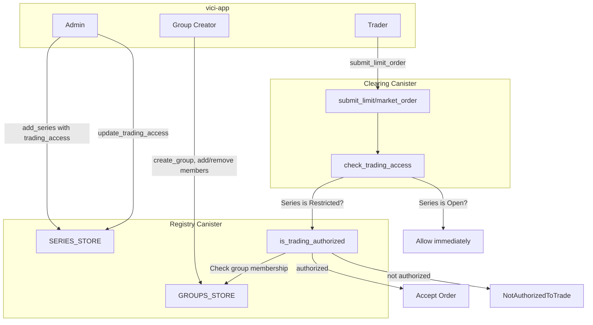
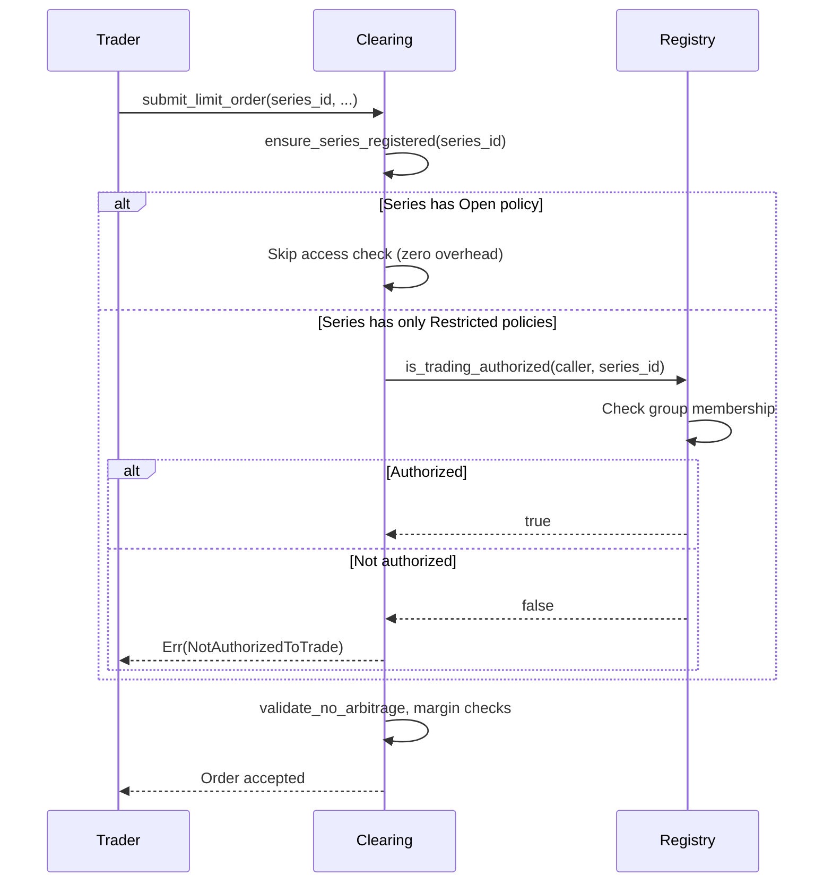

# Closed Circles: Restricted Trading Groups

This document describes the architecture for "closed circles" — a system that allows prediction markets to be restricted to specific groups of traders rather than being open to everyone.

## Overview

By default, every series (prediction market) is open to all authenticated users. With closed circles, an admin can restrict a series so that only members of designated groups may submit orders. Groups are managed on-chain in the registry canister and enforced by the clearing canister at order submission time.

A series can have **multiple trading access policies** simultaneously. If any policy grants access, the trader is authorized. This enables future extensibility (e.g., token-gated access, reputation-based access) without breaking existing policies.

## Architecture



## Data Model

### TradingAccess (shared types)

```rust
enum TradingAccess {
    Open,                                // anyone can trade
    Restricted { groups: Vec<GroupId> },  // only group members
}
```

A `Series` holds `trading_access: Vec<TradingAccess>`. **This list must never be empty** — every series carries at least one policy (default: `[Open]`). Authorization is evaluated as an OR across all policies: if any policy grants access, the caller can trade. The invariant is enforced by `add_series` (fills `[Open]` if empty) and `update_trading_access` (rejects empty with `EmptyTradingAccess`).

### Group

```rust
struct Group {
    group_id: GroupId,
    name: String,
    creator: Principal,
    members: BTreeSet<Principal>,
    created_at_ns: u64,
}
```

Groups are stored in the registry's `GROUPS_STORE`. Any authenticated user with the `GROUP_CREATOR` role can create groups and manage membership (add/remove principals).

## Enforcement Flow



Key design decisions:

1. **Zero overhead for open markets.** The clearing canister caches the series and checks `trading_access` locally. If the series contains an `Open` policy, no inter-canister call is made.

2. **No stale membership cache.** Group membership can change at any time. The clearing canister always queries the registry for restricted series rather than caching group members. Only the `TradingAccess` policy type is cached on the series.

3. **Controllers bypass.** Registry controllers are always authorized, regardless of group membership.

## Registry API (Groups)

| Endpoint                                           | Guard                     | Description                                              |
| -------------------------------------------------- | ------------------------- | -------------------------------------------------------- |
| `create_group(CreateGroupParams)`                  | `caller_is_not_anonymous` | Creates a group; caller becomes creator and first member |
| `add_group_members(UpdateGroupMembersParams)`      | Creator or controller     | Adds principals to a group                               |
| `remove_group_members(UpdateGroupMembersParams)`   | Creator or controller     | Removes principals from a group                          |
| `get_group(GroupId)`                               | Public query              | Returns group details                                    |
| `list_groups(Option<Principal>)`                   | Public query              | Lists groups, optionally filtered by creator             |
| `delete_group(GroupId)`                            | Creator or controller     | Deletes a group                                          |
| `is_group_member(GroupId, Principal)`              | Public query              | Checks membership                                        |
| `is_trading_authorized(Principal, SeriesId)`       | Public query              | Resolves all policies for a series                       |
| `update_trading_access(UpdateTradingAccessParams)` | Controller only           | Changes trading access on a series                       |

## vici-app Roles

| Role                   | Permissions                                                          |
| ---------------------- | -------------------------------------------------------------------- |
| `CONTROLLER` / `ADMIN` | All permissions including `CREATE_GROUP` and `MANAGE_TRADING_ACCESS` |
| `GROUP_CREATOR`        | `CREATE_GROUP` — can create and manage groups                        |
| `CREATOR`              | `CREATE_MARKET` — cannot manage trading access (admin does that)     |

## Backward Compatibility

- **On-chain state:** The `trading_access` field uses `#[serde(default = "default_trading_access")]`, which fills `[Open]` for series created before the closed-circles feature. This upholds the invariant that the list is never empty.
- **Registry stable storage:** Uses a versioned `StableState` struct with fallback to the legacy tuple format for canisters that haven't been upgraded yet.
- **App layer:** The `mapTradingAccess` utility handles `undefined` (pre-upgrade Candid types) defensively by defaulting to `[{ type: 'Open' }]`.

## Future Extensions

The `TradingAccess` enum is designed for extensibility. Potential future variants:

- `TokenGated { token: Principal, min_balance: u128 }` — require holding a minimum token balance
- `ReputationBased { min_score: u64 }` — require a minimum reputation score
- `TimeLimited { open_from_ns: u64, open_until_ns: u64 }` — time-windowed access

Each new variant only requires adding the enum case in shared types, the authorization logic in `is_trading_authorized`, and UI support in the app.
