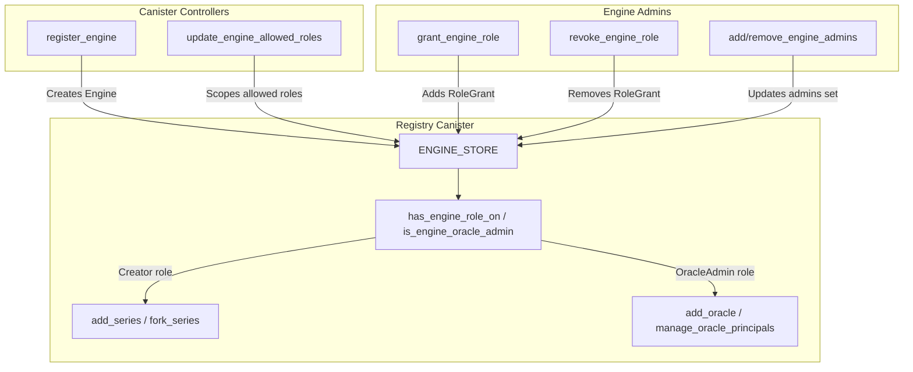
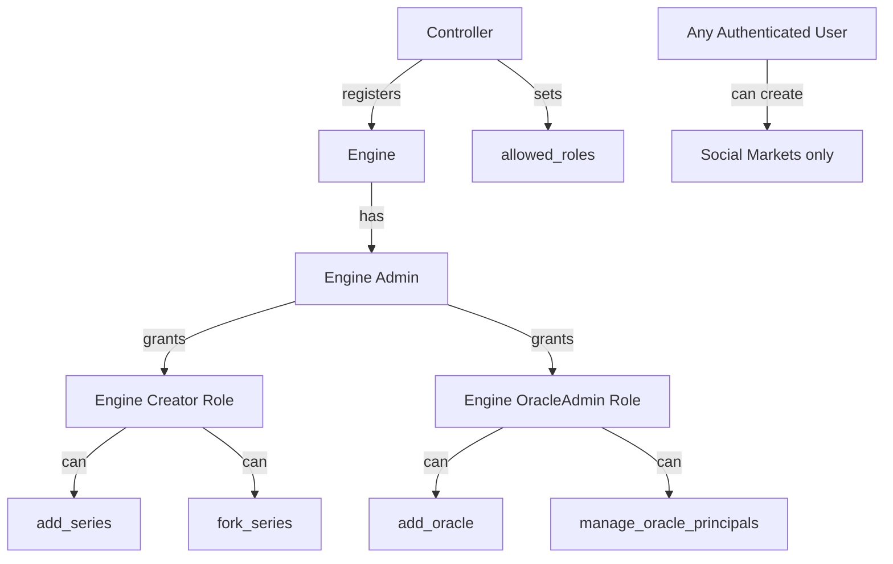
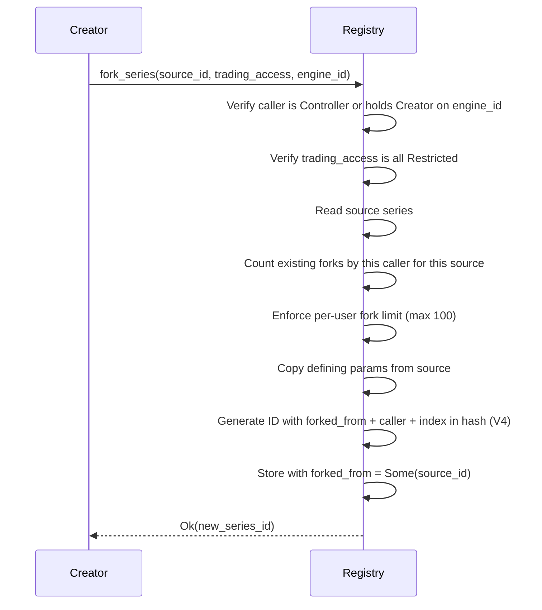

# Multi-Tenant Engine Model

This document describes the Engine system -- a multi-tenant authorization layer that allows dApps to manage their own creators, oracle admins, and other roles without being canister controllers.

## Overview

An **Engine** is an organizational entity registered by a canister controller. It represents a dApp or service that uses the ICDC clearing layer. Each Engine has its own admins, role grants, and (optionally) social market rate limits.

The Engine model replaces the previous flat `AUTHORIZED_CREATORS` and `AUTHORIZED_FORKERS` maps with a structured, auditable, role-based system.

## Architecture



## Authorization Hierarchy



Authorization is checked from most privileged to least:

1. **Controller** -- can do everything, including registering Engines and setting `allowed_roles`.
2. **Engine Admin** -- can grant/revoke roles within their Engine (subject to `allowed_roles`), manage other admins, and update Engine metadata.
3. **Engine Creator** -- can create series (`add_series`) and fork series (`fork_series`). Must specify the `engine_id` they hold the `Creator` role on. Cannot manage oracles.
4. **Engine `OracleAdmin`** -- can register oracles (`add_oracle`) and manage oracle metadata and principals **registry-wide** (see [Design Note: `OracleAdmin` scope](#design-note-oracleadmin-scope)).
5. **Any authenticated user** -- can create social (non-monetary) markets with `Restricted` trading access, subject to rate limits.

## Data Model

### Engine

```rust
struct Engine {
    engine_id: EngineId,            // "eng_0", "eng_1", ...
    name: String,
    description: Option<String>,
    icon_url: Option<String>,
    creator: Principal,             // immutable, always treated as admin
    admins: BTreeSet<Principal>,
    allowed_roles: BTreeSet<EngineRole>,
    role_grants: Vec<RoleGrant>,    // audit trail
    social_limits: Option<SocialLimits>,
    created_at_ns: u64,
    updated_at_ns: u64,
    updated_by: Principal,
}
```

### EngineRole

```rust
enum EngineRole {
    Creator,      // add_series, fork_series
    OracleAdmin,  // add_oracle, manage oracle principals/metadata
}
```

New roles can be added to this enum over time at the protocol level.

### RoleGrant

```rust
struct RoleGrant {
    principal: Principal,
    role: EngineRole,
    granted_by: Principal,
    granted_at_ns: u64,
}
```

Every grant records who performed it and when, providing a full audit trail.

### allowed_roles Scoping

When a controller registers an Engine, they specify which roles the Engine's admins are allowed to grant via `allowed_roles`. For example:

- An Engine with `allowed_roles: {Creator}` can only grant `Creator` roles -- its admins cannot grant `OracleAdmin`.
- An Engine with `allowed_roles: {Creator, OracleAdmin}` can grant both.
- A controller can update `allowed_roles` at any time via `update_engine_allowed_roles`.

This prevents privilege escalation: an Engine cannot grant roles beyond what the controller explicitly permits.

## Design Note: `OracleAdmin` scope

The `OracleAdmin` role grants **registry-wide** oracle management, not management scoped to a specific Engine.

**Rationale**: Oracles are shared infrastructure consumed by series across multiple Engines. A single oracle (e.g., "Chainlink ETH/USD") may serve series created by many different Engines, so scoping oracle management per-engine would create unnecessary fragmentation and operational overhead.

**Current behaviour**: Any principal holding `OracleAdmin` on _any_ Engine can call `add_oracle`, `update_oracle_metadata`, and `manage_oracle_principals` for _any_ oracle in the registry.

**Future extensibility**: If per-engine oracle ownership is needed (e.g., an Engine wants exclusive control over its custom oracle), the `Oracle` struct can be extended with an optional `engine_id` field. This would allow `OracleAdmin` holders to be restricted to managing only oracles owned by their Engine, while leaving `engine_id: None` oracles as globally managed.

## Fork Series

The `fork_series` endpoint creates a copy of an existing series with a distinct ID and a `forked_from` reference:



The forked series:

- Inherits all defining parameters (underlying, expiry, payoff type, strike, payout unit, outcomes, oracle source).
- Gets a distinct ID because `forked_from`, the caller principal, and a per-caller monotonic fork index are all included in the V4 hash. This allows multiple forks of the same source by the same or different callers.
- Must have `Restricted` trading access (enforcing that forks create closed circles).
- Allows optional title/description overrides.
- Limited to **100 forks per user per source series** (`MAX_FORKS_PER_SOURCE_PER_USER`).

## Registry API (Engines)

| Endpoint                                                      | Guard        | Description                                          |
| ------------------------------------------------------------- | ------------ | ---------------------------------------------------- |
| `register_engine(RegisterEngineParams)`                       | Controller   | Registers a new Engine                               |
| `update_engine(UpdateEngineParams)`                           | Engine admin | Updates Engine metadata                              |
| `update_engine_allowed_roles(UpdateEngineAllowedRolesParams)` | Controller   | Changes the set of grantable roles                   |
| `grant_engine_role(GrantEngineRoleParams)`                    | Engine admin | Grants a role to a principal (subject to scoping)    |
| `revoke_engine_role(RevokeEngineRoleParams)`                  | Engine admin | Revokes a role from a principal                      |
| `add_engine_admins(UpdateEngineAdminsParams)`                 | Engine admin | Adds admin principals                                |
| `remove_engine_admins(UpdateEngineAdminsParams)`              | Engine admin | Removes admin principals (creator cannot be removed) |
| `get_engine(EngineId)`                                        | Public query | Returns Engine details                               |
| `list_engines()`                                              | Public query | Lists all registered Engines                         |

**"Engine admin"** means: canister controller, Engine creator, or a principal in the Engine's `admins` set.

## State Migration

The upgrade from V3 (flat maps) to V4 (engines) is automatic:

1. All principals from `AUTHORIZED_CREATORS` and `AUTHORIZED_FORKERS` are merged into a "Legacy" Engine (`eng_0`).
2. Each principal gets a `RoleGrant { role: Creator }`.
3. The Legacy Engine has `allowed_roles: {Creator}`.
4. `NEXT_ENGINE_ID` starts at 1.

No manual intervention is needed. Existing series remain unchanged; new fields (`engine_id`, `forked_from`) default to `None` via Candid deserialization.

## Series Fields

Two optional fields on `Series`:

- `engine_id: Option<EngineId>` -- the Engine on whose behalf this series was created. Populated when the caller supplies `engine_id` in `AddSeriesParams` or `ForkSeriesParams`. Controllers may omit it; non-controller Engine Creators must provide it.
- `forked_from: Option<SeriesId>` -- if this series was forked, the source series ID.

### `engine_id` authorization flow

| Caller type    | `engine_id` param | Result                                                             |
| -------------- | ----------------- | ------------------------------------------------------------------ |
| Controller     | `None`            | Allowed, series has `engine_id: None`                              |
| Controller     | `Some(id)`        | Allowed, series has `engine_id: Some(id)`                          |
| Non-controller | `Some(id)`        | Verified: caller must hold `Creator` on that Engine                |
| Non-controller | `None`            | Rejected with `EngineIdRequired` (unless creating a social market) |
