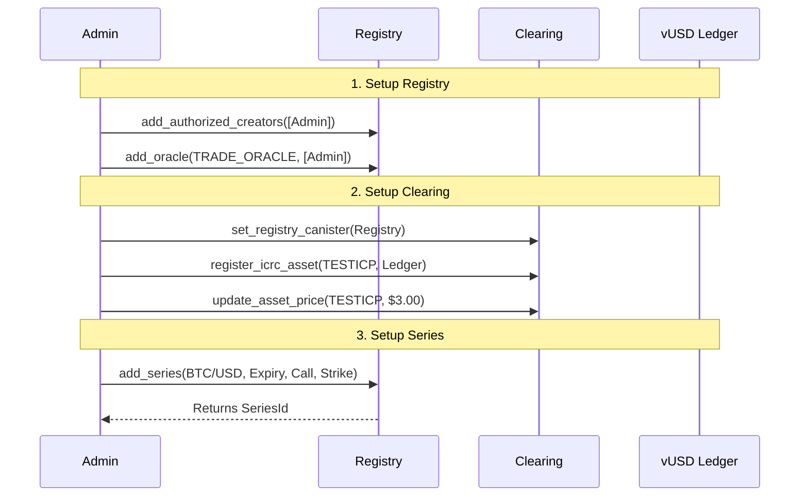
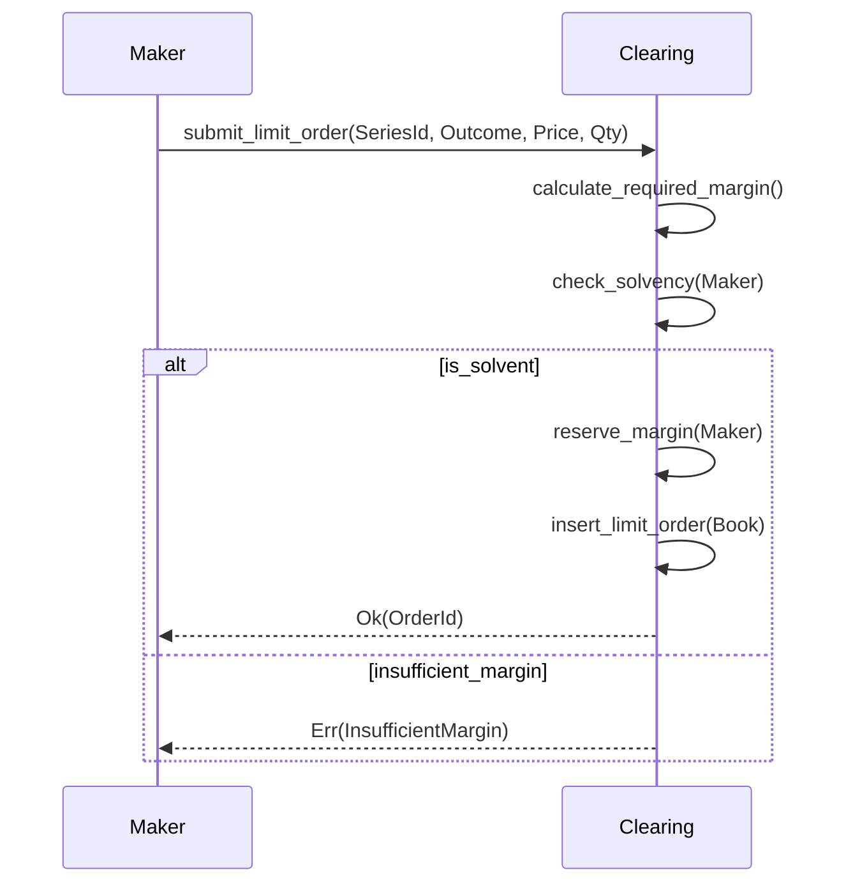
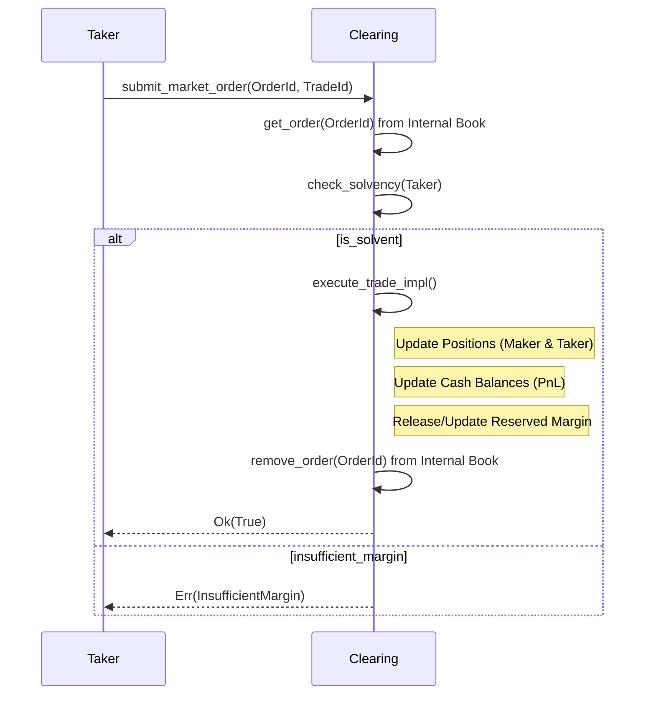
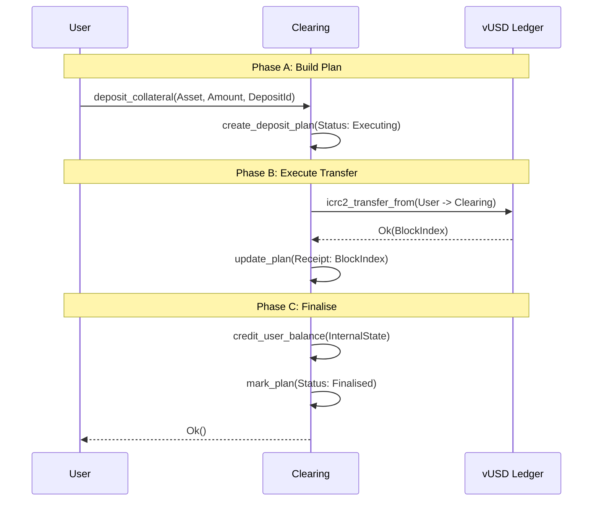
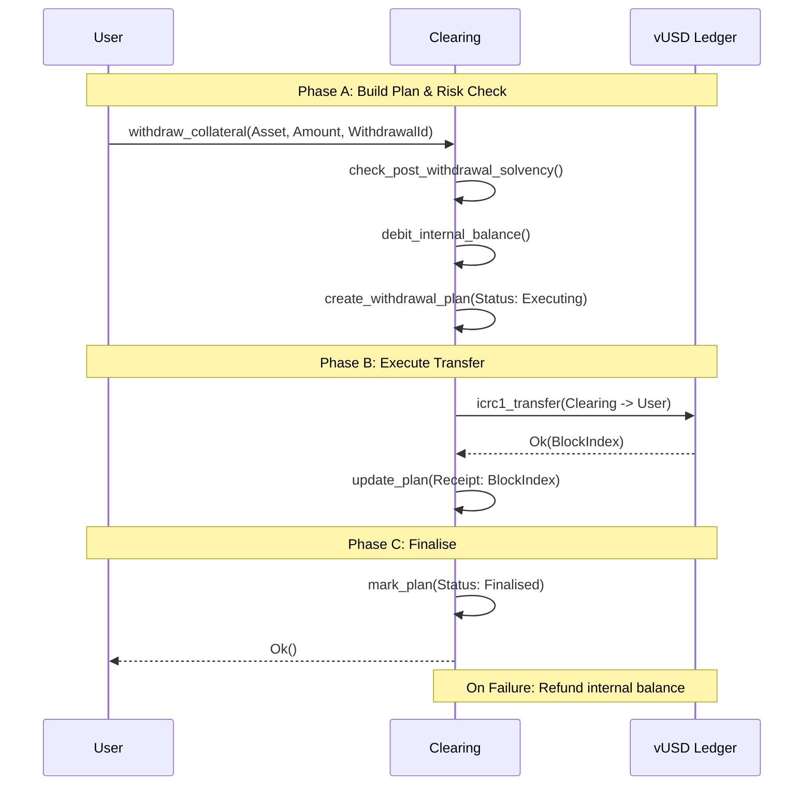
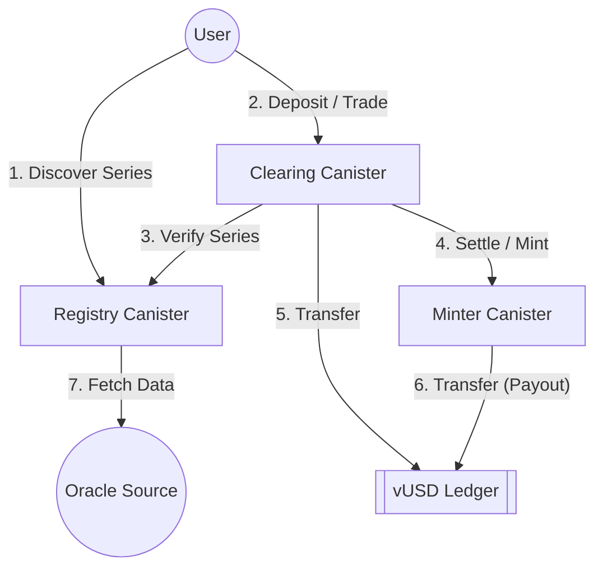
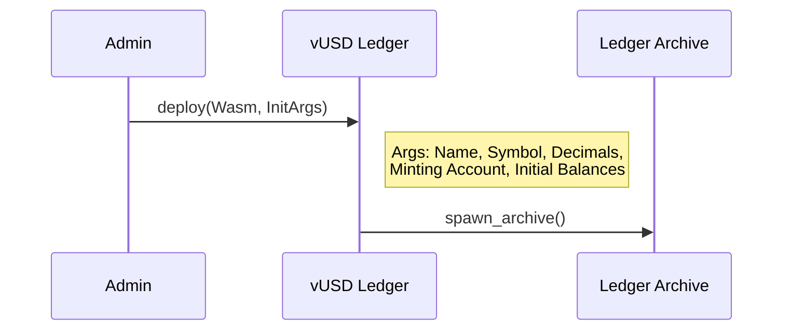
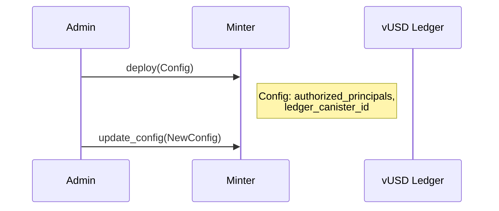
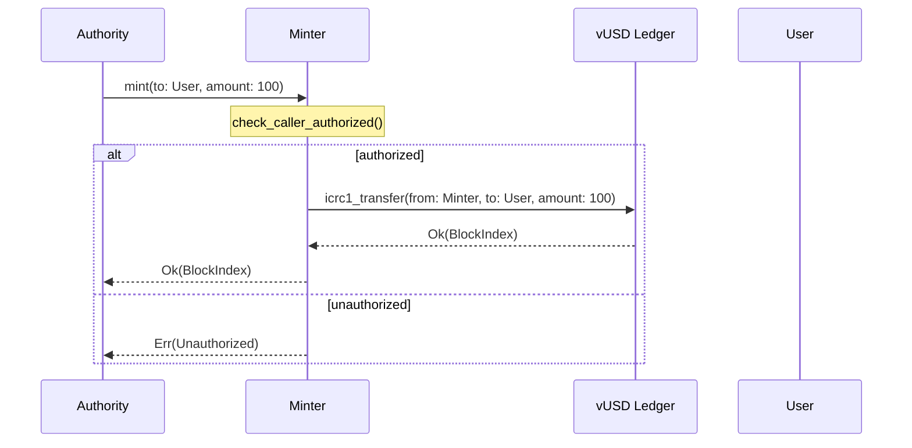
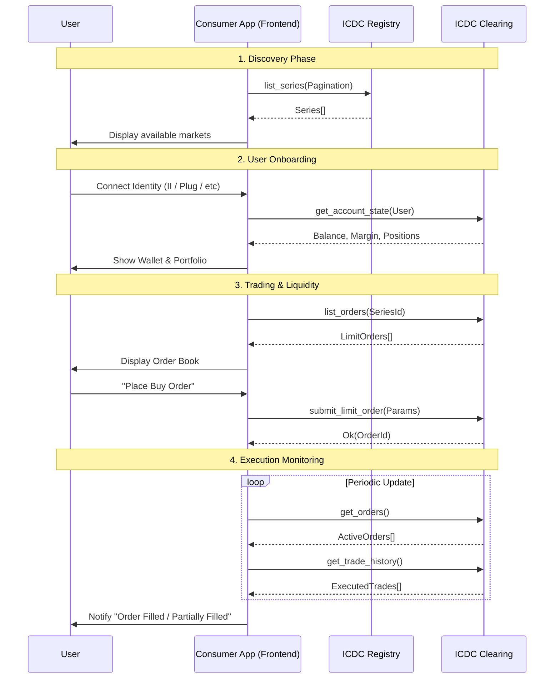

# Project Flow Schematics

This document provides high-level schematics of the core functional flows within the ICDC ecosystem. These diagrams use Mermaid syntax to illustrate the interactions between users, the ICDC canisters (Registry, Clearing, Minter), and external LEDGERS.

## 1. Initialisation Flow

The initialisation process sets up the environment before any trading can occur.

## 2. Trading Flow

### 2.1 Submit Limit Order (Maker)

An atomic operation that reserves margin before placing the order in the book.

### 2.2 Submit Market Order (Taker)

Matches an existing limit order and executes the trade atomically.

## 3. Collateral Management (Plan-Execute-Finalise)

Collateral operations are multi-phase to ensure safety and idempotency in an asynchronous environment.

### 3.1 Deposit Collateral

### 3.2 Withdrawal Collateral

## 4. Inter-canister Interaction Map

> [!NOTE]
> **Internal vs. External Settlement**
>
> In ICDC, "Trading" and "Clearing" are decoupled from "Settlement" on the main ledger.
>
> - **Internal (Trading/Netting)**: When a trade is executed, only the internal `AccountState` and `Positions` within the Clearing canister are updated. This allows for sub-second, atomic execution without waiting for ledger blocks.
> - **External (Deposit/Withdrawal)**: The `vUSD Ledger` is only involved when a user moves funds in or out of the clearing infrastructure.

## 5. Minter & vUSD Ledger Details

### 5.1 vUSD Ledger Initialisation

The `vUSD Ledger` is a standard ICRC-1 ledger.

### 5.2 Minter Initialisation

The Minter acts as a permissioned bridge to the Ledger.

### 5.3 Minting / Payout Flow

Highly restricted process to move funds from the system's "Minting" source to users.

> [!NOTE]
> **Minting Permissions**
>
> In the production environment, the `Minter` canister's principal would typically be the `minting_account` of the `vUSD Ledger` OR hold a significant balance designated for payouts. Access to the `mint` method is strictly gated.

## 6. Consumer Application Flow

A typical consumer application (e.g., a Trading Front-end or Liquidity Provider) acts as the bridge between the end-user and the ICDC infrastructure.

